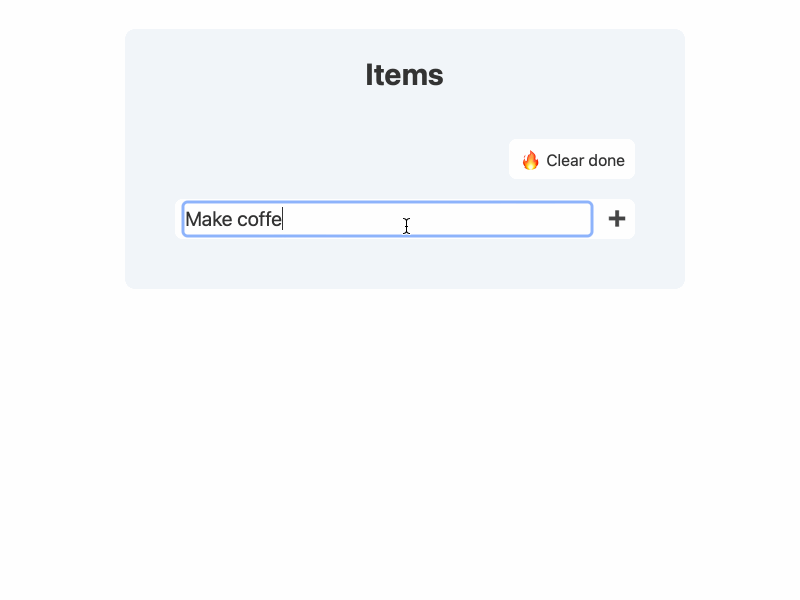

# 🦀 htmx todos

Server-side rendered todo app that uses [`htmx`](https://htmx.org) for reactivity, [`Maud`](https://maud.lambda.xyz) for templating, and tailwind for styling. The storage is setup using [`sqlx`](https://github.com/launchbadge/sqlx) crate and SQLite for simplicity.



## Setup

Crate `sqlx-cli` is used to set up the database and run migrations. The following commands should be enough to set up the database:

```bash
cp .env.example .env
cargo install sqlx-cli
sqlx database create
sqlx migrate run --source db/migrations
```

After that, you can run the app using `cargo run`. The app should be available at `http://localhost:8080`.

## Tailwind CSS IntelliSense

The configuration provided in `tailwind.config.js` should enhance your development experience in VS Code by making [Tailwind CSS IntelliSense](https://marketplace.visualstudio.com/items?itemName=bradlc.vscode-tailwindcss) fully functional for `*.rs` template files.
